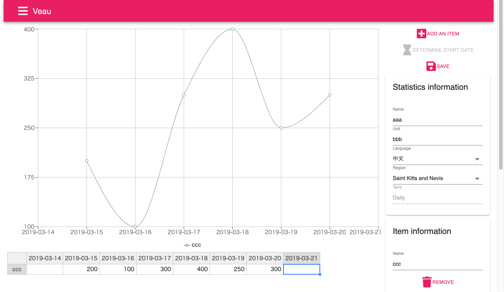

# Veau

Veau (pronunciation /vo/) is for the users who treat statistics.  
This system supports the users to simplify the input statistics data by showing the data in the chart.

Veau (prononciation /vo/) est pour les utilisateurs qui traitent les statistiques.  
Ce système soutient les utilisateurs pour simplififier l'input des données des statistiques en montrant les données dans le graphique.

Veau (pronunciación /vo/) es para los usuarios quien manejan las estadísticas.  
Este sistema mantiene los usuarios para simplificar la entrada de datos de las estadísticas demostrando los datos en el gráfico.

Veau (発音 /vo/) は統計を取り扱うユーザーのためのものです。  
このシステムは図にデータを表示することによってユーザーの統計データ入力を補助します。



## Demo

[https://veau.jamashita.dev](https://veau.jamashita.dev)

### Account and Password

for English users

```
Account: english
Password: english
```

para los usuarios españoles

```
Account: español
Password: espanol
```

pour les utilisateurs français

```
Account: français
Password: francais
```

日本のユーザー向け

```
Account: 日本語
Password: nihongo
```

## Requests

Veau is constructing. When you have some requests, create a new issue.

Veau está construyendo. Cuando tienes unas peticiones, cree un nuevo problema.

Veau est en construisant. Quand tu as des demandes, crée un nuveau problème.

Veauは構築中です。要望があるときは問題を作成してください。

## When you find wrong translations

Veau may contain some wrong translations because of my insufficient translation ability.  
If you find one, please tell me and I will correct it immediately.  
Thank you for your cooperation.

Veau puede contener algunas traducciones incorrectas porque mi apitud de la traducción insuficiente.  
Si encuentras una, por favor dime y la corrijo inmediatamente.  
Gracias por tu cooperación.

Veau peut contenir des erreurs de traduction à cause de ma abilité de la traduction insuffisante.  
Si tu trouves une, dis-moi et je la corrige immediatement, s'il vous plaît.  
Merci pour ta coopéation.

私の翻訳能力が十分でないため、Veauには誤った翻訳が含まれている可能性があります。  
誤った翻訳を見つけた時は伝えてください、すぐに修正します。  
ご協力ありがとうございます。

## For developers
### Run in development mode
#### Prerequirement
docker is required.  
if you haven't installed docker for desktop, install it first.

1. run `yarn install`
2. move to `deployment/development` directory
3. run `docker-compose up -d` to run mysql and redis in docker
4. move to root directory in this project
5. build the app by running `yarn build`
6. run `yarn gulp:watch` to run the server (server runs in foreground)
7. run `yarn webpack:watch` to run the frontend (frontend also runs in foreground so you have to launch new window in addition to the server)
8. access `http://localhost:4000` and you will see the app login page
9. the account and password are already provided, please see the *Account and Password* section.

## License

[MIT](LICENSE)
