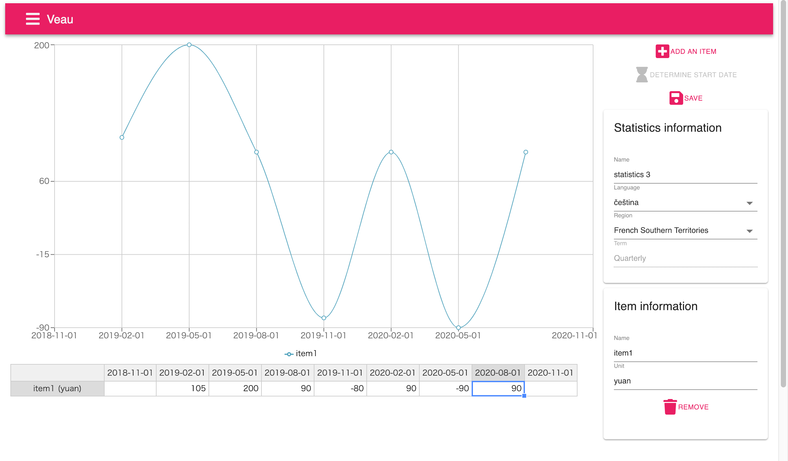

# Veau

Veau (pronunciation /vo/) is for the users who treat statistics. 



## Demo

[https://www.jamashita.dev/](https://www.jamashita.dev/)

### Account and Password

for English user

```
Account: english
Password: englsih
```

for Spanish user

```
Account: español
Password: espanol
```

for French user

```
Account: français
Password: francais
```

for Japanese user

```
Account: 日本語
Password: nihongo
```

### License

MIT
