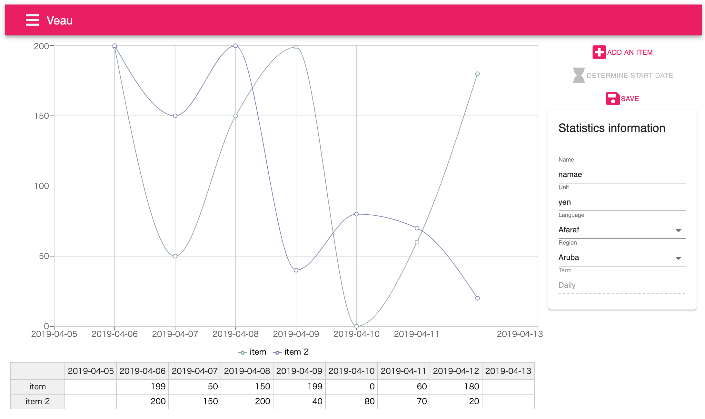

# Veau


[](https://conventionalcommits.org)

## Demo



<https://veau.jamashita.dev>


## Requisite

```
> node -v
v14.5.0

> npm -v
6.14.5

> yarn -v
1.22.5
```

### Account and Password

for English users

```
Account: English
Password: english
```

para los usuarios españoles

```
Account: Español
Password: espanol
```

pour les utilisateurs français

```
Account: Français
Password: francais
```

日本のユーザー向け

```
Account: 日本語
Password: nihongo
```

## Conventional commit

```
git cz
```

## Run in development mode

### Requisite

Docker is required.  
if you haven't installed docker for desktop, install it first.

1. run `yarn install`
1. move to `deployment/development` directory
1. run `docker-compose up -d` to run mysql and redis in docker
1. move to root directory in this project
1. build the app by running `yarn build`
1. run `yarn watch`
1. access `http://localhost:4000` and you will see the app login page
1. the account and password are already provided, please see the *Account and Password* section.

## License

[MIT](LICENSE)
